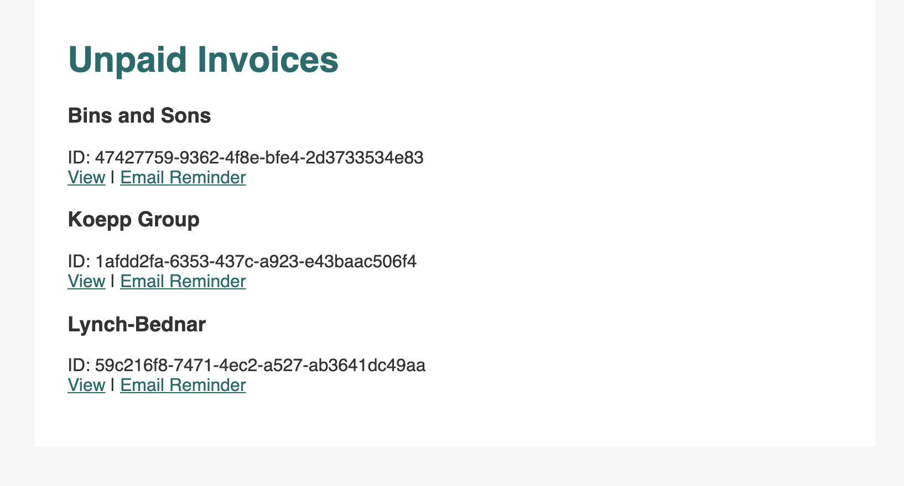
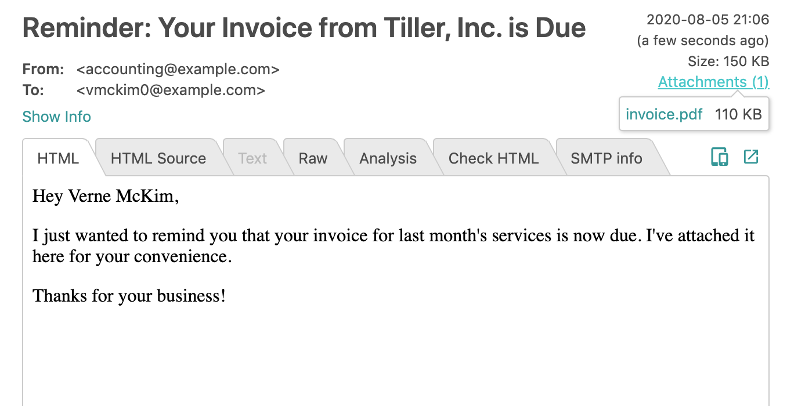

# Foxit Email Invoice

This Node application demonstrates using the Foxit HTML2PDF tool to generate invoices
and email them to your clients.

## Prerequisites
- Foxit SDK access and HTML2PDF compiled on your machine
- NPM and Node (version 8+)
- Mailtrap account (for testing emails)

## Setup
- Clone this repository
- Install dependencies: `npm i`
- Log into Mailtrap to get your username and password. Test emails will be sent here.
- Run the local server: `MAILTRAP_USERNAME=<YOUR_MAILTRAP_SMTP_USERNAME> MAILTRAP_PASSWORD=<YOUR_MAILTRAP_SMTP_PASSWORD> npm start`
- Visit [localhost:3000/invoices](http://localhost:3000/invoices) and click "Email Reminder" to try it out

### Web application

### Email Preview in Mailtrap

